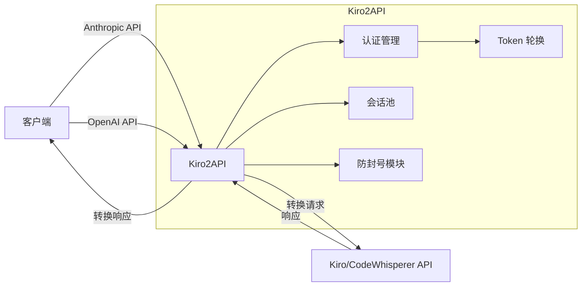

# Kiro2API

<p align="center">
  
  
  
</p>

<p align="center">
  <strong>🚀 将 Anthropic/OpenAI API 请求转换为 Kiro/AWS CodeWhisperer API 请求的代理服务</strong>
</p>

---

## ⚠️ 免责声明

本项目仅供学习研究使用，使用者需自行承担使用风险。本项目与 AWS/Kiro/Anthropic/Claude 等官方无关，不代表任何官方立场。

---

## 📖 项目简介

**Kiro2API** 是一个用 Go 语言编写的高性能 API 代理服务，能够将标准的 Anthropic Claude API 和 OpenAI API 格式的请求无缝转换为 Kiro/AWS CodeWhisperer API 请求。支持流式响应、Thinking 模式、工具调用等高级功能。

---

## ✨ 特性列表

| 特性 | 描述 |
|------|------|
| 🔄 **双协议支持** | 同时兼容 Anthropic 和 OpenAI API 格式 |
| 📡 **流式响应（SSE）** | 支持 Server-Sent Events 实时流式输出 |
| 🧠 **Thinking 模式** | 支持 Claude Extended Thinking 功能 |
| 🛠️ **工具调用** | 完整支持 Anthropic tool use / Function Calling |
| 🔐 **多凭据支持** | 支持配置多个账号，智能轮换与故障转移 |
| 🛡️ **防封号机制** | 请求指纹随机化、智能间隔、指数退避等 |
| 🌐 **代理池支持** | 多代理轮换，增强稳定性 |
| 📊 **Web 管理界面** | 实时监控 Token 状态和使用情况 |
| 🔑 **OAuth 授权** | Web 页面一键获取 RefreshToken |
| ♻️ **Token 自动刷新** | 自动管理和刷新 OAuth Token |

---

## 🏗️ 架构概览



---

## 🚀 快速开始

### 环境要求

- **Go**: 1.24 或更高版本（源码编译）
- **Docker**: 20.10 或更高版本（容器部署）
- **网络**: 能够访问 AWS 服务

### 安装方式

#### 方式一：源码编译

```bash
# 克隆仓库
git clone https://github.com/your-repo/kiro2api.git
cd kiro2api

# 编译
go build -o kiro2api main.go

# 运行
./kiro2api
```

#### 方式二：Docker 部署

```bash
# 构建镜像
docker build -t kiro2api .

# 运行容器
docker run -p 8080:8080 --env-file .env kiro2api
```

### 基础配置

1. 复制配置文件模板：

```bash
cp .env.example .env
cp auth_config.json.example auth_config.json
```

2. 编辑 `.env` 文件，设置必要的环境变量：

```bash
# 必填：客户端认证令牌
KIRO_CLIENT_TOKEN=your-secure-random-password

# 必填：认证配置（JSON 或文件路径）
KIRO_AUTH_TOKEN=./auth_config.json

# 可选：Web 管理界面访问密码（Basic Auth）
KIRO_UI_PASSWORD=your-ui-password

# 可选：服务端口
PORT=8080
```

3. 编辑 `auth_config.json`，配置上游认证信息（参见[认证配置](#-认证配置)章节）

4. 启动服务：

```bash
./kiro2api
```

---

## 📡 API 使用

### 支持的端点

#### Anthropic API 兼容

| 端点 | 方法 | 描述 |
|------|------|------|
| `/v1/messages` | POST | Anthropic Claude API 代理 |
| `/v1/messages/count_tokens` | POST | Token 计数接口 |
| `/v1/models` | GET | 获取可用模型列表 |

#### OpenAI API 兼容

| 端点 | 方法 | 描述 |
|------|------|------|
| `/v1/chat/completions` | POST | OpenAI Chat Completions API 代理 |

### Anthropic API 格式示例

```bash
curl http://127.0.0.1:8080/v1/messages \
  -H "Content-Type: application/json" \
  -H "x-api-key: your-client-token" \
  -d '{
    "model": "claude-sonnet-4-20250514",
    "max_tokens": 1024,
    "messages": [
      {"role": "user", "content": "Hello, Claude!"}
    ]
  }'
```

**流式响应：**

```bash
curl http://127.0.0.1:8080/v1/messages \
  -H "Content-Type: application/json" \
  -H "x-api-key: your-client-token" \
  -d '{
    "model": "claude-sonnet-4-20250514",
    "max_tokens": 1024,
    "stream": true,
    "messages": [
      {"role": "user", "content": "写一首诗"}
    ]
  }'
```

**Thinking 模式：**

```bash
curl http://127.0.0.1:8080/v1/messages \
  -H "Content-Type: application/json" \
  -H "x-api-key: your-client-token" \
  -d '{
    "model": "claude-sonnet-4-20250514",
    "max_tokens": 16000,
    "thinking": {
      "type": "enabled",
      "budget_tokens": 10000
    },
    "messages": [
      {"role": "user", "content": "解决这道数学题..."}
    ]
  }'
```

或使用 `-thinking` 后缀自动启用：

```bash
curl http://127.0.0.1:8080/v1/messages \
  -H "Content-Type: application/json" \
  -H "x-api-key: your-client-token" \
  -d '{
    "model": "claude-sonnet-4-20250514-thinking",
    "max_tokens": 16000,
    "messages": [
      {"role": "user", "content": "解决这道数学题..."}
    ]
  }'
```

**工具调用：**

```bash
curl http://127.0.0.1:8080/v1/messages \
  -H "Content-Type: application/json" \
  -H "x-api-key: your-client-token" \
  -d '{
    "model": "claude-sonnet-4-20250514",
    "max_tokens": 1024,
    "tools": [
      {
        "name": "get_weather",
        "description": "获取指定城市的天气",
        "input_schema": {
          "type": "object",
          "properties": {
            "city": {"type": "string", "description": "城市名称"}
          },
          "required": ["city"]
        }
      }
    ],
    "messages": [
      {"role": "user", "content": "北京今天天气怎么样？"}
    ]
  }'
```

### OpenAI API 格式示例

```bash
curl http://127.0.0.1:8080/v1/chat/completions \
  -H "Content-Type: application/json" \
  -H "Authorization: Bearer your-client-token" \
  -d '{
    "model": "claude-sonnet-4-20250514",
    "max_tokens": 1024,
    "messages": [
      {"role": "user", "content": "Hello, Claude!"}
    ]
  }'
```

**流式响应：**

```bash
curl http://127.0.0.1:8080/v1/chat/completions \
  -H "Content-Type: application/json" \
  -H "Authorization: Bearer your-client-token" \
  -d '{
    "model": "claude-sonnet-4-20250514",
    "max_tokens": 1024,
    "stream": true,
    "messages": [
      {"role": "user", "content": "写一首诗"}
    ]
  }'
```

---

## ⚙️ 配置详解

### 基础配置

| 变量 | 默认值 | 描述 |
|------|--------|------|
| `KIRO_CLIENT_TOKEN` | - | 客户端认证令牌（**必填**） |
| `KIRO_AUTH_TOKEN` | - | 认证配置 JSON 或文件路径（**必填**） |
| `KIRO_UI_PASSWORD` | - | Web 管理界面访问密码（Basic Auth，保护 `/`、`/static`、`/api`、`/oauth`） |
| `PORT` | `8080` | 服务监听端口 |
| `LOG_LEVEL` | `info` | 日志级别：debug, info, warn, error |
| `GIN_MODE` | `release` | Gin 框架模式：debug, release, test |

### 会话池配置

| 变量 | 默认值 | 描述 |
|------|--------|------|
| `SESSION_POOL_ENABLED` | `true` | 启用会话池 |
| `SESSION_POOL_MAX_SIZE` | `3` | 每个会话最大 Token 数量 |
| `SESSION_POOL_MAX_RETRIES` | `5` | 429 错误最大重试次数 |
| `SESSION_POOL_COOLDOWN` | `60s` | Token 冷却时间 |
| `SESSION_POOL_TTL` | `30m` | 会话池过期时间 |

### 防封号配置

| 变量 | 默认值 | 描述 |
|------|--------|------|
| `RATE_LIMIT_MIN_INTERVAL` | `5s` | 单 token 最小请求间隔 |
| `RATE_LIMIT_MAX_INTERVAL` | `15s` | 单 token 最大请求间隔 |
| `RATE_LIMIT_MAX_CONSECUTIVE` | `3` | 单 token 最大连续使用次数 |
| `RATE_LIMIT_DAILY_MAX` | `500` | 每个 token 每日最大请求次数 |
| `RATE_LIMIT_COOLDOWN` | `5m` | Token 冷却时间 |
| `RATE_LIMIT_BACKOFF_BASE` | `1m` | 指数退避基数 |
| `RATE_LIMIT_BACKOFF_MAX` | `30m` | 指数退避最大值 |
| `RATE_LIMIT_JITTER_PERCENT` | `30` | 请求间隔抖动百分比 |
| `PROXY_POOL` | - | 代理池配置（逗号分隔） |

### OAuth 配置

| 变量 | 默认值 | 描述 |
|------|--------|------|
| `OAUTH_ENABLED` | `false` | 启用 OAuth 授权页面 |
| `OAUTH_TOKEN_FILE` | - | OAuth Token 存储文件路径 |
| `OAUTH_CALLBACK_BASE_URL` | - | OAuth 回调基础 URL（可选） |

---

## 🔑 认证配置

### 客户端认证

客户端调用 API 时需要提供认证令牌，支持两种方式：

| 方式 | 格式 |
|------|------|
| x-api-key Header | `x-api-key: your-client-token` |
| Authorization Bearer | `Authorization: Bearer your-client-token` |

### 上游认证配置

支持两种上游认证方式：

| 认证方式 | 说明 | 必填字段 |
|---------|------|---------|
| **Social** | 社交账号登录（Google/GitHub 等） | `refreshToken` |
| **IdC** | AWS IAM Identity Center / Builder ID | `refreshToken`, `clientId`, `clientSecret` |

### auth_config.json 格式

```json
[
  {
    "auth": "Social",
    "refreshToken": "your_social_refresh_token_here",
    "disabled": false
  },
  {
    "auth": "IdC",
    "refreshToken": "your_idc_refresh_token_here",
    "clientId": "your_idc_client_id",
    "clientSecret": "your_idc_client_secret",
    "disabled": false
  }
]
```

### 配置方式

**方式一：环境变量 JSON 格式**

```bash
# 单凭据
KIRO_AUTH_TOKEN='{"auth":"Social","refreshToken":"your_token"}'

# 多凭据
KIRO_AUTH_TOKEN='[
  {"auth":"Social","refreshToken":"token1"},
  {"auth":"IdC","refreshToken":"token2","clientId":"xxx","clientSecret":"xxx"}
]'
```

**方式二：配置文件路径**

```bash
KIRO_AUTH_TOKEN=/path/to/auth_config.json
```

### Token 获取方式

**Social Tokens：**
- 通常位于 `~/.aws/sso/cache/` 目录下
- 查找包含 `refreshToken` 字段的 JSON 文件

**IdC Tokens：**
- 位于 `~/.aws/sso/cache/` 目录下
- 需要同时获取 `clientId` 和 `clientSecret`

---

## 🤖 模型支持

### 模型映射

| 请求模型名称 | 后端模型标识 |
|-------------|-------------|
| `claude-opus-4-5-20251101` | CLAUDE_OPUS_4_5_20251101_V1_0 |
| `claude-sonnet-4-5-20250929` | CLAUDE_SONNET_4_5_20250929_V1_0 |
| `claude-sonnet-4-20250514` | CLAUDE_SONNET_4_20250514_V1_0 |
| `claude-3-7-sonnet-20250219` | CLAUDE_3_7_SONNET_20250219_V1_0 |
| `claude-3-5-haiku-20241022` | auto |
| `claude-haiku-4-5-20251001` | auto |

### Thinking 模式

在模型名后添加 `-thinking` 后缀可自动启用思考模式：

```
claude-sonnet-4-20250514-thinking
```

**参数说明：**
- `budget_tokens`: 思考预算，范围 1024~24576，默认 20000
- Thinking 模式需要较大的 `max_tokens`（建议 16000+）

---

## 🛡️ 防封号机制

Kiro2API 内置多层防封号保护机制：

### 1. 请求指纹随机化
- 每个 Token 绑定唯一的客户端指纹
- 包括：User-Agent、语言、时区、屏幕分辨率等
- 指纹在 Token 生命周期内保持一致

### 2. 智能请求间隔
- 随机间隔 5-15 秒（可配置）
- 额外 30% 随机抖动
- 模拟人类操作节奏

### 3. 智能 Token 轮换
- 严格轮询策略
- 连续使用 3 次后自动切换
- 基于剩余额度加权选择

### 4. 指数退避机制
- 收到 403/429 错误后触发
- 退避序列：1m → 2m → 4m → ... → 最大 30m
- 自动恢复

### 5. 每日请求限制
- 每个 Token 每日最多 500 次请求
- 自动在 UTC 00:00 重置

### 6. 代理池支持
- 多代理随机选择
- 使用次数限制（单个代理最多使用 10 次后轮换）
- 健康检查与自动恢复

```bash
# 代理池配置示例
PROXY_POOL=http://127.0.0.1:40000,http://127.0.0.1:40001,http://127.0.0.1:40002
```

---

## 🌐 Web 管理界面

| 端点 | 描述 |
|------|------|
| `/` | Dashboard 管理页面 |
| `/oauth` | OAuth 授权页面 |
| `/api/tokens` | Token 池状态 API |
| `/api/anti-ban/status` | 防封号状态 API |

访问 `http://localhost:8080/` 可查看 Dashboard，实时监控：
- Token 状态和剩余额度
- 请求统计
- 防封号状态

---

## 🐳 Docker 部署

### 使用 docker run

```bash
docker run -d \
  --name kiro2api \
  -p 8080:8080 \
  -e KIRO_CLIENT_TOKEN=your-secure-token \
  -e KIRO_AUTH_TOKEN='[{"auth":"Social","refreshToken":"xxx"}]' \
  -e SESSION_POOL_ENABLED=true \
  -e LOG_LEVEL=info \
  -v /path/to/data:/app/data \
  kiro2api
```

### 使用 docker-compose

创建 `docker-compose.yml`：

```yaml
version: '3.8'

services:
  kiro2api:
    build: .
    container_name: kiro2api
    ports:
      - "8080:8080"
    environment:
      - KIRO_CLIENT_TOKEN=your-secure-token
      - KIRO_AUTH_TOKEN=/app/config/auth_config.json
      - PORT=8080
      - LOG_LEVEL=info
      - GIN_MODE=release
      - SESSION_POOL_ENABLED=true
      - SESSION_POOL_MAX_SIZE=3
      - SESSION_POOL_MAX_RETRIES=5
      - OAUTH_ENABLED=true
      - OAUTH_TOKEN_FILE=/app/data/oauth_tokens.json
    volumes:
      - ./auth_config.json:/app/config/auth_config.json:ro
      - ./data:/app/data
    restart: unless-stopped
    healthcheck:
      test: ["CMD", "wget", "-q", "--spider", "http://localhost:8080/v1/models"]
      interval: 30s
      timeout: 10s
      retries: 3
```

启动服务：

```bash
docker-compose up -d
```

### 多平台构建

```bash
# 构建 amd64 和 arm64 镜像
docker buildx build --platform linux/amd64,linux/arm64 -t kiro2api .
```

---

## 🔧 开发

### 项目结构

```
kiro2api/
├── main.go                 # 程序入口
├── auth/                   # 认证模块
│   ├── auth.go             # 认证服务
│   ├── config.go           # 配置加载
│   ├── oauth.go            # OAuth 实现
│   ├── token_manager.go    # Token 管理
│   ├── fingerprint.go      # 设备指纹
│   ├── rate_limiter.go     # 速率限制
│   └── proxy_pool.go       # 代理池
├── server/                 # HTTP 服务
│   ├── server.go           # 主服务器
│   ├── handlers.go         # 请求处理器
│   ├── middleware.go       # 中间件
│   ├── openai_handlers.go  # OpenAI 兼容处理
│   └── stream_processor.go # 流式响应处理
├── converter/              # 协议转换
│   ├── openai.go           # OpenAI 格式转换
│   ├── codewhisperer.go    # CodeWhisperer 格式转换
│   └── tools.go            # 工具转换
├── parser/                 # 解析器
│   ├── event_stream_types.go   # AWS EventStream 类型
│   ├── header_parser.go        # 头部解析
│   └── thinking_detector.go    # Thinking 模式检测
├── types/                  # 类型定义
│   ├── anthropic.go        # Anthropic 类型
│   ├── openai.go           # OpenAI 类型
│   └── codewhisperer.go    # CodeWhisperer 类型
├── config/                 # 配置
│   ├── config.go           # 模型映射
│   └── constants.go        # 常量定义
├── utils/                  # 工具函数
├── logger/                 # 日志模块
├── static/                 # 静态资源（Web 界面）
├── Dockerfile              # Docker 构建文件
└── README.md               # 项目文档
```

### 技术栈

| 组件 | 库 |
|------|-----|
| Web 框架 | [gin-gonic/gin](https://github.com/gin-gonic/gin) v1.11.0 |
| JSON 处理 | [bytedance/sonic](https://github.com/bytedance/sonic) v1.14.1（高性能） |
| Token 计数 | [pkoukk/tiktoken-go](https://github.com/pkoukk/tiktoken-go) v0.1.7 |
| UUID 生成 | [google/uuid](https://github.com/google/uuid) v1.3.0 |
| 环境变量 | [joho/godotenv](https://github.com/joho/godotenv) v1.5.1 |

### 本地开发

```bash
# 安装依赖
go mod download

# 开发模式运行
GIN_MODE=debug LOG_LEVEL=debug go run main.go

# 运行测试
go test ./...

# 构建
go build -o kiro2api main.go
```

---

## 📜 License

本项目采用 [MIT License](LICENSE) 开源协议。

---

## 🙏 致谢

本项目的实现参考了以下开源项目：

- [kiro.rs](https://github.com/hank9999/kiro.rs)
- [proxycast](https://github.com/aiclientproxy/proxycast)

感谢以上项目的作者和贡献者！
